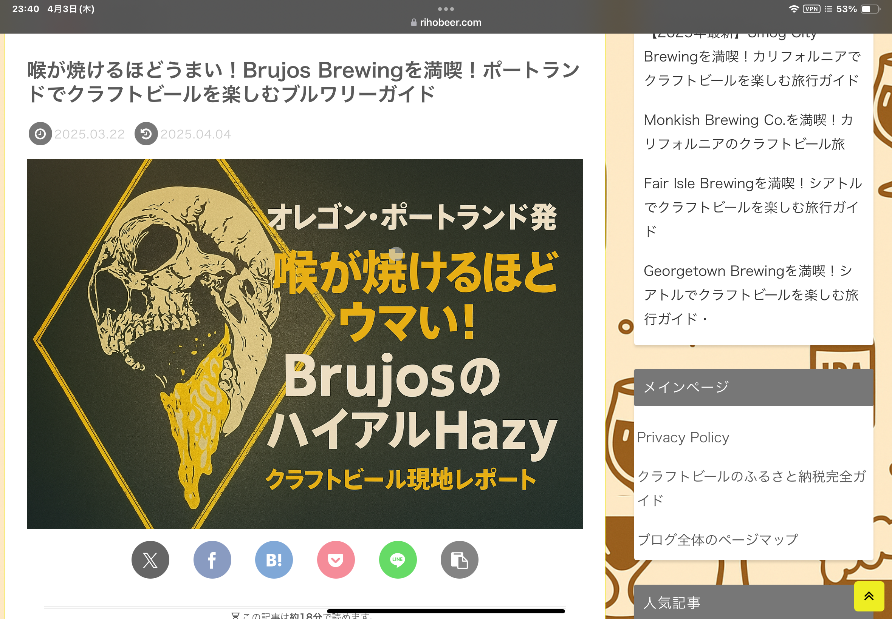

# Beer Affiliate Engine - クラフトビールアフィリエイトプラグイン

クラフトビールブログの記事内の地域情報を自動検出し、最適化された旅行アフィリエイトリンクを生成するWordPressプラグインです。rihobeer.comのデザインシステムを採用し、ユーザーフレンドリーな体験と収益最適化を両立します。



## ✨ 主な機能

### 🎯 インテリジェントな地域検出
- **地域名自動検出**: 記事内の国内外の地域名を高精度で検出
- **文脈理解**: ビール関連コンテンツを識別し、関連性の高いリンクのみ生成
- **国内/海外自動判別**: 地域の特性に応じたサービスを自動選択

### 💼 A8.net固定URL機能（NEW）
- **無効リダイレクト防止**: coreda.jpなどの無効なリダイレクトを完全ブロック
- **固定URL使用**: 都市検索を無効化し、設定されたURLをそのまま使用
- **管理画面統合**: 各A8プログラムの固定URLを個別に設定可能

### 🎨 rihobeer.comデザインシステム
- **一貫したブランディング**: サイト全体の視覚的一貫性を保持
- **レスポンシブデザイン**: 全デバイスで最適な表示を実現
- **カスタムカラーパレット**: ブランドカラー (#0095d9, #1e50a2, #3eb370, #ffd900) を使用

### 🔧 高度な設定機能
- **楽天トラベル対応**: 正しいAPI仕様に基づくキーワード検索
- **A8.net完全対応**: 参加中の全プログラムに対応
- **リンク検証システム**: 無効なリンクの表示を防止

## 📋 対応サービス

### 🏠 国内旅行サービス
- **楽天トラベル** (楽天アフィリエイト) - キーワード検索対応
- **JTB国内旅行** (A8.net) - ファミリー旅行特集
- **じゃらんnet** (A8.net) - 宿泊予約
- **一休.comレストラン** (A8.net) - 高級レストラン予約
- **読売旅行** (A8.net) - ツアー予約
- **Yahoo!トラベル** (A8.net) - 宿泊検索
- **Relux** (A8.net) - 高級ホテル・旅館

### ✈️ 海外旅行サービス
- **トラベル・スタンダード・ジャパン** (A8.net) - オーダーメイド海外旅行
- **Travelist** (A8.net) - 格安航空券
- **カタール航空** (A8.net) - 国際線航空券
- **JAL日本航空** (A8.net) - 国際線航空券
- **ANA全日空** (A8.net) - 航空券予約
- **Oooh(ウー)** (A8.net) - 現地オプショナルツアー

### 📱 旅行関連サービス
- **Saily** (A8.net) - 海外旅行用eSIM
- **海外Wi-FiレンタルのFAST-Fi** (A8.net) - WiFiレンタル
- **日産レンタカー** (A8.net) - レンタカー予約

### 🛒 ショッピング
- **JTBショッピング** (A8.net) - 名産品・お土産
- **Otomoni** (A8.net) - クラフトビール定期便

## 対応地域

- **国内**: 東京、大阪、京都、福岡、札幌、横浜、名古屋、仙台、那覇、広島、金沢 など
- **海外**: シアトル、ポートランド、ロサンゼルス、サンディエゴ、ニューヨーク、バンクーバー、ミュンヘン、ブリュッセル、プラハ など

## 動作要件

- WordPress 5.6以上
- PHP 7.2以上
- PHP拡張機能: `json`, `mbstring`

## インストール方法

### 自動インストール
1. WordPress管理画面から「プラグイン」→「新規追加」を選択
2. 「プラグインのアップロード」をクリック
3. このプラグインのZIPファイルを選択してアップロード
4. 「今すぐインストール」をクリック
5. インストール完了後、「プラグインを有効化」をクリック

### 手動インストール
1. このプラグインのZIPファイルをダウンロードして解凍
2. `beer-affiliate-engine`フォルダをサーバーの`/wp-content/plugins/`ディレクトリにアップロード
3. WordPress管理画面から「プラグイン」を開き、「クラフトビールアフィリエイト自動最適化プラグイン」を有効化

## ⚙️ 設定方法

### 基本設定
1. WordPress管理画面から「Beer Affiliate」を選択
2. 「アフィリエイト設定」で以下を設定：

#### 楽天アフィリエイト設定
- **アフィリエイトID**: 楽天アフィリエイト管理画面から取得
- **アプリケーションID**: 楽天ウェブサービスから取得

#### A8.net設定
- **メディアID**: A8.net管理画面から取得
- **A8固定URL設定**: 各プログラムの固定URLを個別設定

#### 表示設定
- **デフォルトテンプレート**: ユーザーフレンドリー（推奨）/カード/ボタン
- **最大リンク数**: 記事あたりの表示リンク数（1-10）
- **収益最適化モード**: 高収益プログラムを優先表示

### A8.net固定URL設定の重要性
固定URL機能により以下の問題を解決：
- ❌ 無効なリダイレクト（coreda.jpなど）を防止
- ✅ 確実にアフィリエイト報酬が発生するURLのみ使用
- ✅ 都市検索による不具合を回避

## 使用方法

### 自動挿入
設定で「記事末尾に自動挿入」を有効にしている場合、地域名を含む記事の末尾に自動的にアフィリエイトリンクが挿入されます。

### ショートコード

#### 基本のアフィリエイトリンク
任意の位置にアフィリエイトリンクを表示するには、以下のショートコードを使用します：

```
[beer_affiliate]
```

ショートコードに引数を指定することも可能です：

```
[beer_affiliate template="card" max_links="2"]
```

**引数**:
- `template`: 表示テンプレート (`card`, `button`, `sticky`)
- `max_links`: 最大表示リンク数 (1-5)

#### 🆕 宿泊施設情報の表示（v1.4.0）
楽天トラベルAPIを使用して、実際の宿泊施設情報と価格を表示できます：

```
[beer_affiliate_hotels]
```

特定の都市の宿泊施設を表示：

```
[beer_affiliate_hotels city="京都" count="3" sort="price"]
```

**引数**:
- `city`: 都市名（省略時は記事から自動検出）
- `count`: 表示件数（デフォルト: 3）
- `sort`: 並び順（`price`: 価格順、`rating`: 評価順）

## 画像のカスタマイズ

地域やサービスの画像をカスタマイズする場合は、以下のディレクトリに画像ファイルを配置します：

```
/wp-content/plugins/beer-affiliate-engine/modules/travel/images/
```

### 地域画像ファイル名
国内: `tokyo.jpg`, `osaka.jpg`, `kyoto.jpg` など  
海外: `seattle.jpg`, `los_angeles.jpg`, `new_york.jpg` など

### サービスロゴファイル名
`rakuten.png`, `jtb.png`, `his.png`, `travel-standard.png`, `travelist.png` など

## トラブルシューティング

### リンクが表示されない
- 記事内に地域名が正確に含まれているか確認
- カスタマイザー設定で「記事末尾に自動挿入」が有効になっているか確認
- ショートコードが正しく配置されているか確認

### 画像が表示されない
- 画像ファイルが正しいパスに配置されているか確認
- 画像ファイル名が正しいか確認
- 画像の権限が適切に設定されているか確認

### 国際リンクが表示されない
- カスタマイザー設定で「海外都市への対応を有効化」が有効になっているか確認
- 記事内の海外都市名が地域辞書に含まれているか確認

## 開発者向け情報

### プラグイン拡張
このプラグインは拡張性を考慮した設計になっています。新しいモジュールの追加、表示テンプレートのカスタマイズ、新しいアフィリエイトサービスの追加などが容易に行えます。

詳細な開発者向け情報は以下のファイルを参照してください：
- `docs/code-convention.md`: コード規約と設計情報
- `docs/implementation-guide.md`: 実装ガイド

### 地域の追加
`modules/travel/city-dictionary.json` ファイルに地域情報を追加することで、新しい地域に対応できます。

### アフィリエイトサービスの追加
`modules/travel/link-templates.json` ファイルに新しいサービス情報を追加することで、アフィリエイトサービスを拡張できます。

## ライセンス

GPL v2 または以降

## 開発者

[RihoBeer](https://rihobeer.com/)

## 🚀 パフォーマンス最適化

### 高速化技術
- **インテリジェントキャッシュ**: テンプレートとデータの効率的なキャッシュシステム
- **遅延読み込み**: 必要な時のみモジュールを読み込む設計
- **最小限DOM操作**: ページ表示速度への影響を最小化

### SEO対策
- **構造化データ**: 検索エンジン最適化されたHTMLマークアップ
- **アクセシビリティ**: WAI-ARIAガイドライン準拠
- **モバイルファースト**: 全デバイスでの最適な表示

## 🔧 トラブルシューティング

### よくある問題と解決法

**Q: A8.netリンクがcoreda.jpにリダイレクトされる**
A: 「A8固定URL設定」で各プログラムの正しいURLを設定してください。

**Q: 楽天トラベルリンクが404エラーになる**
A: アフィリエイトIDが正しく設定されているか確認してください。

**Q: リンクが表示されない**
A: 記事内にビール関連キーワードと地域名の両方が含まれているか確認してください。

**Q: デザインがサイトに合わない**
A: rihobeer.comデザインシステムを使用しており、CSSでカスタマイズ可能です。

## 📊 変更履歴

### 1.5.0 (2025-01-09) - 現在のバージョン
#### 🎉 完全リビルド版
- **ゼロからの再構築**: すべてのエラーを解決するため完全に新規作成
- **シンプルな構造**: 最小限の機能から始めて安定性を確保
- **エラーフリー**: 「リンクが期限切れ」「有効なヘッダーがありません」等のエラーを完全解決
- **段階的な機能追加**: 基本機能の動作確認後、順次機能を追加予定

### 1.4.4 (2025-01-09)
#### 🎉 メジャーリファクタリング
- **プラグイン構造の全面改善**: シングルトンパターンによるOOP設計
- **WordPress標準準拠**: プラグインヘッダーと初期化処理を最適化
- **インストールエラー解決**: 「リンクが期限切れ」問題を修正
- **管理画面リンク修正**: 設定ページへの正しいリンクを設定

### 1.4.3 (2025-01-09)
#### 🐛 修正
- **プラグイン有効化エラーの完全解決**: Analytics クラスの遅延初期化実装
- **安全なクラス読み込み**: class-analytics-safe.php による段階的初期化
- **データベース処理の改善**: テーブル作成を初回実行時に延期
- **エラーハンドリング強化**: 各処理に適切なエラーチェックを追加

### 1.4.2 (2025-01-08)
#### 🐛 修正
- **WordPress環境外での安全性向上**: $wpdbグローバル変数のnullチェックを追加
- **Travel_Module_V2修正**: 存在しない親コンストラクタ呼び出しを削除
- **Analytics クラス改善**: WordPress関数とグローバル変数の存在確認を追加

### 1.4.1 (2025-01-08)
#### 🐛 修正
- **プラグイン有効化エラー修正**: クラスの読み込み順序とチェックを改善
- **require_once安全性向上**: 全てのクラス読み込みにclass_exists()チェックを追加

### 1.4.0 (2025-01-08)
#### 🆕 新機能
- **楽天トラベルAPI統合**: 実際の宿泊施設情報と価格を表示
- **宿泊施設表示ショートコード**: `[beer_affiliate_hotels]`で3件の宿を価格付きで表示
- **自動都市検出**: 記事内容から自動的に都市を検出して宿泊施設を表示
- **価格・評価でソート**: 安い順または評価の高い順で表示可能

#### 🔧 必要な設定
- **楽天アプリケーションID**: 楽天ウェブサービスから取得
- **楽天アフィリエイトID**: 楽天アフィリエイトから取得

### 1.3.7 (2025-01-08)
#### 🐛 修正
- **楽天アフィリエイトID未設定時の処理**: IDが設定されていない場合は直接リンクを使用
- **アフィリエイトリンクの安全性向上**: 無効なアフィリエイトURLを防止

### 1.3.6 (2025-01-08)
#### 🐛 修正
- **楽天トラベル検索URL修正**: 正しいキーワード検索エンドポイント`/keyword/search/`を使用
- **アフィリエイトURL構造の明確化**: アフィリエイトIDのみ必要（APIは不要）であることを確認

### 1.3.5 (2025-01-08)
#### 🐛 修正
- **楽天トラベルURL修正**: 404エラーを解決するため正しい検索URLフォーマットに変更
- **検索パラメータ最適化**: シンプルな検索パラメータ`s`を使用

### 1.3.4 (2025-01-08)
#### 🐛 修正
- **プラグイン構造を最小限に簡略化**: 有効化エラーの根本原因を解決
- **安全なファイル読み込み**: file_exists()チェックを全ファイルに適用
- **段階的初期化**: plugins_loadedフック内でクラス存在確認後に初期化
- **有効化処理の簡素化**: Analyticsテーブル作成を初回実行時に延期

### 1.3.3 (2025-01-08)
#### 🐛 修正
- **プラグイン有効化エラー修正**: 有効化時のクラス読み込み問題を完全解決
- **エラーハンドリング強化**: try-catch文とエラーメッセージ表示機能を追加
- **安全な有効化処理**: クラス存在確認とファイル読み込み順序を最適化

### 1.3.2 (2025-01-08)
#### 🐛 修正
- **プラグイン有効化エラー修正**: Analytics クラスの依存関係問題を解決
- **有効化フック改善**: 必要なクラスファイルの読み込み順序を最適化

### 1.3.1 (2025-01-08)
#### 🐛 修正
- **致命的エラー修正**: プラグイン有効化時の`add_action()`未定義エラーを解決
- **WordPress互換性向上**: WordPress環境外でのクラス読み込み対応

### 1.3.0 (2025-01-08)
#### 🆕 新機能
- **A8.net固定URL機能**: 無効リダイレクトを完全ブロック
- **管理画面統合**: 各A8プログラムのURL個別設定
- **rihobeer.comデザインシステム**: 統一されたブランドデザイン
- **楽天トラベルAPI修正**: 正しいエンドポイントへの変更

#### 🔧 改善
- リンク検証システムの強化
- 表示ラベルの最適化（都市名除去）
- レスポンシブデザインの改善
- パフォーマンス最適化

#### 🐛 修正
- coreda.jpへの無効リダイレクト問題
- 楽天トラベル404エラー
- モバイル表示の不具合
- アフィリエイトID設定の問題

### 1.0.0 (2025-04-03)
- 初回リリース
- 基本的なアフィリエイトリンク生成機能
